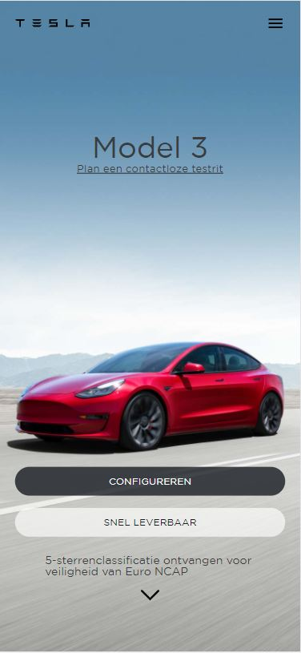
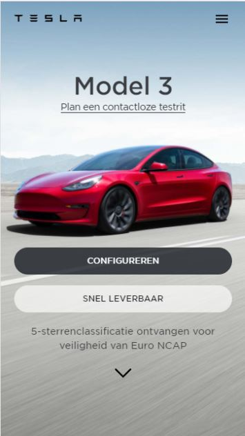
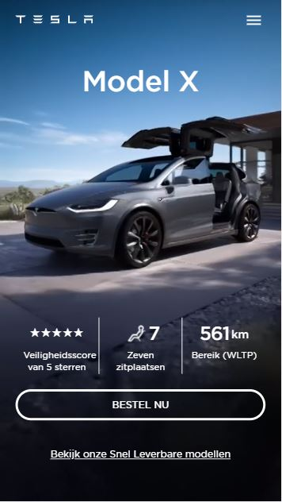

# Procesverslag
**Auteur:** Robbin Jansen
**Klas:** 206a

## Bronnenlijst
1. all images: https://www.tesla.com

## Eindgesprek (week 7/8)

Ik ben erg veel bezig geweest met het schrijven van een JavaScript functie die de verschillende sectie overlays op de home-page laat in- en uitfaden. Echter is dit na 3 dagen worstelen niet gelukt. Ik wilde eerst de overlays laten faden aan de hand van de scroll positie. Dit werkte echter niet goed met de responsiveness. Ik heb daarom een formule gemaakt die een waarde geeft per sectie. Dit is gelukt echter wanneer ik hier de overlays mee laat faden gaat het mis. Het lijkt erop dat de formule niet werkt vanwege de scroll snap die is ingebouwd.

Omdat ik de overlay fade niet goed werkend kreeg heb ik helaas moeten beslissen hiermee te stoppen om de deadline nog te kunnen halen. Ik heb de home-pagina opnieuw ingedeeld op een manier dat de overlays sticky zijn op de verschillende secties.

Vervolgens heb ik met JavaScript een uitklapbaar navigatiemenu gemaakt.
Omdat dit succesvol was verlopen ben ik aan de slag gegaan met mijn 2e pagina (model X).

Eén van de uitdagingen op deze pagina was de video achtergrond op de eerste sectie. Dit is uiteindelijk dankzij de geweldige website stackoverflow gelukt.
Over deze pagina ben ik wel enigszins tevreden echter heb ik nog wel last van een paar bugs waardoor de secties niet mooi aansluiten. Tevens heb ik geprobeerd met JavaScript een mouseover functie voor de buttons maar deze werkte niet vanwege de pointer events die uitstaan voor de scroll snap. 

De website is responsive van mobiel tot desktop.

**Screenshot(s):**

-screenshot(s) van je eindresultaat-

## Voortgang 3 (week 6)

Ik heb de homepage nu opgedeeld in verschillende secties. Ik wil deze aan de hand van de scroll positie laten in- of uitfaden met
JavaSCript.

## Voortgang 2 (week 5)

### Stand van zaken

Ik ben vooral bezig geweest met het onder de knie krijgen van de oefeningen en het inhalen van herkansingen. Ik heb daarom de website nog even links laten liggen. Ik ben wel bezig geweest om de overlay over de sections te krijgen. Het is mij echter nog nog niet gelukt dit goed te krijgen want de scroll snap gaat hierdoor fout. Verder heb ik wel een scroll snap toegevoegd aan de verschillende secties en een footer. Deze footer moet nog een fade in effect krijgen. Hier ben ik mee bezig.

## Voortgang 1 (week 3)

### Stand van zaken

Het opzetten van de website tot dusver ging goed. Uitdagingen die ik tot nu toe ben tegengekomen waren het installeren van het custom font en de header juist opmaken met flexbox en position: fixed.

Ik krijg het font nog niet helemaal zoals ik wil. De font-weight is maar beperkt in te stellen en ik krijg deze nog niet gelijk met die van tesla.com.

**Screenshot(s):**

Dit is hoe de home page er nu uit ziet. Als je naar beneden scrollt komen verschillende background images voorbij. Het is nog de bedoeling dat de overlay zich hier aan aanpast als je scrollt. Dit ga ik met JavaScript doen.

### Agenda voor meeting

-samen met je groepje opstellen-

| student 1      | student 2          | student 3    | student 4        |
| ---            | ---                | ---          | ---              |
| dit bespreken  | en dit             | en ik dit    | en dan ik dat    |
| an dat ook nog | dit als er tijd is | nog een punt | dit wil ik zeker |
| ...            | ...                | ...          | ...              |

### Verslag van meeting

-na afloop snel uitkomsten vastleggen-

## Breakdownschets (week 1)

## Intake (week 1)
-uitwerken voor de kick-off werkgroep - begin van de eerste week-

**Je startniveau:** rood

**Je focus:** surface plane (eventueel later ook responsive)

**Je opdracht:** https://www.tesla.com/nl_be/modelx

**Screenshot(s) van de eerste pagina (small screen):**

**Screenshot(s) van de tweede pagina (small screen):**

